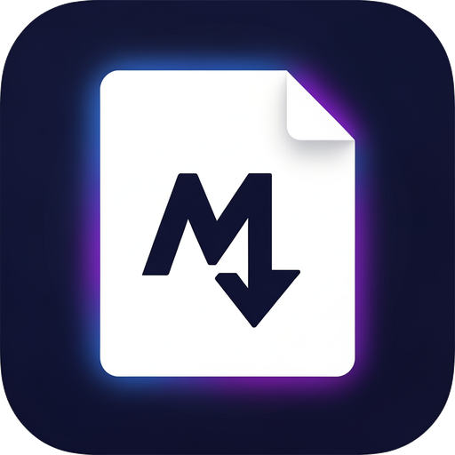

<p align="center">
  
</p>

<h1 align="center">Markdown Reader</h1>

<p align="center">
  A simple, lightweight desktop application for reading and editing Markdown files on Windows.
</p>

<p align="center">
  <a href="https://github.com/BrennanNVA/MarkdownReader/actions/workflows/tests.yml"></a>
  
  
</p>

Markdown Reader gives you a live rendered preview beside the Markdown source, accepts files by drag-and-drop, and can export the finished document directly to PDF. It is built with Python and PySide6 and does not require a web browser or server.

## Features

- Drag-and-drop `.md`, `.markdown`, `.mdown`, and `.mkd` files
- Live GitHub-style Markdown preview while editing
- Split view, preview-only view, and editor-only view
- New, Open, Close, Save, and Save As commands
- Export the rendered document as a PDF
- Zoom in, zoom out, and reset zoom
- Find text and move between matches
- Undo, redo, cut, copy, paste, and select all
- Recent-files menu
- Unsaved-change protection
- Local images and links resolved relative to the Markdown file
- Familiar Windows keyboard shortcuts

## Download for Windows

For the easiest setup, open the [latest GitHub Release](https://github.com/BrennanNVA/MarkdownReader/releases/latest), download `MarkdownReader-v0.1.1-windows-x64.zip`, extract the entire folder, and run **`Markdown Reader.exe`**.

The portable release does not require Python, `uv`, or an installer.

## Requirements for running from source

- Windows 10 or Windows 11
- Python 3.11 or newer
- [`uv`](https://docs.astral.sh/uv/getting-started/installation/)

## Run from source

1. Download or clone this repository:

   ```bash
   git clone https://github.com/BrennanNVA/MarkdownReader.git
   cd MarkdownReader
   ```

2. Double-click **`run_markdown_reader.bat`**.

On the first run, the launcher creates an isolated virtual environment and installs the required packages. Later launches reuse that environment.

You can also start it from a terminal:

```bash
uv sync --extra dev
uv run markdown-reader
```

To open a file immediately:

```bash
uv run markdown-reader path/to/document.md
```

A sample document is included as `sample.md`.

## Keyboard shortcuts

| Shortcut | Action |
|---|---|
| `Ctrl+N` | New document |
| `Ctrl+O` | Open file |
| `Ctrl+S` | Save |
| `Ctrl+Shift+S` | Save As |
| `Ctrl+W` | Close file |
| `Ctrl+P` | Export as PDF |
| `Ctrl+F` | Find |
| `Ctrl++` / `Ctrl+-` | Zoom in/out |
| `Ctrl+0` | Reset zoom |
| `Ctrl+1` | Split view |
| `Ctrl+2` | Preview only |
| `Ctrl+3` | Editor only |

## Build a standalone Windows application

Double-click **`build_exe.bat`**, or run:

```bash
uv sync --extra dev
uv run pyinstaller --noconfirm --clean --windowed --name "Markdown Reader" --paths src --icon src/markdown_reader/assets/icon.ico --add-data "src/markdown_reader/assets/icon.png;markdown_reader/assets" src/markdown_reader/app.py
```

The portable application will be created at:

```text
dist/Markdown Reader/Markdown Reader.exe
```

Copy the entire `dist/Markdown Reader` directory when moving the application to another Windows computer.

## Development and tests

Install the development dependencies and run the test suite:

```bash
uv sync --extra dev
uv run pytest
```

The tests cover drag-and-drop routing, Markdown loading and rendering, UTF-8 editing and saving, Save As, view and zoom controls, and real PDF generation.

## Technology

- Python 3.11+
- PySide6 / Qt 6
- pytest and pytest-qt
- PyInstaller for optional Windows packaging

## License

Markdown Reader is available under the [MIT License](LICENSE).
